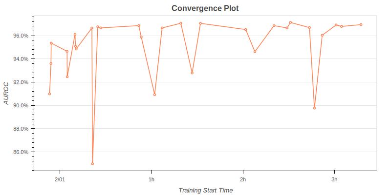
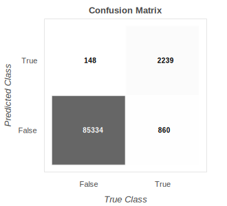

# IEEE-CIS Fraud Detection with Sagemaker Pipelines
### Goals
* Perform common predictive modeling with a SageMaker **Estimator** and **HyperparameterTuner**.
* Use **SageMaker Pipelines** to orchestrate predictive modeling workflows.
  
### Requirements
* The dataset can be downloaded from [this Kaggle competition](https://www.kaggle.com/c/ieee-fraud-detection).
* In addition to the [Anaconda](https://www.anaconda.com) libraries, you need to install `category_encoders`, `selenium`, `geckodriver` and `scikit-learn` version 0.24 or higher.
* You also need to set up an AWS account and install `awscli` and `sagemaker-python-sdk`.

## SageMaker Estimator and HyperparameterTuner
### Data Splitting and Preprocessing
I preprocessed the features in appropriate ways. In particular, in the case of *[XGBoost](https://arxiv.org/pdf/1603.02754.pdf)*, there is no logic to deal with categorical features separately, so I quantified them with *[Target Encoding](https://dl.acm.org/doi/10.1145/507533.507538)* of `category_encoders`.
  
### Hyperparameter Tuning
First, I defined an **Estimator** with SageMaker's **XGBoost framework**. Then, I efficiently obtained the optimal hyperparameter values by fitting a **HyperparameterTuner** that automatically performs a *Bayesian search*. Below are the convergence plot, and the exploration results for each parameter.
* Reference:  
  [How Hyperparameter Tuning Works](https://docs.aws.amazon.com/sagemaker/latest/dg/automatic-model-tuning-how-it-works.html)  
  [Analyze Results of a Hyperparameter Tuning Job](https://github.com/aws/amazon-sagemaker-examples/blob/master/hyperparameter_tuning/analyze_results/HPO_Analyze_TuningJob_Results.ipynb)

### Model Evaluation
After defining the **Transformer** of the optimal **Estimator**, I obtained the predicted values in batches through **Batch Transform**. By comparing them with labels, predictive performance can be measured, which are the confusion matrix, ROC curve, and Precision - Recall curve drawn below.
  
|Accuracy|Precision|Recall|F1|AUROC|AUPRC|    
|:------:|:---:|:---:|:---:|:---:|:---:|
|98.65%|92.45%|66.99%|77.69%|96.92%|83.28%|  

### Model Retraining
Finally, after retraining the model by combining the training set and the test set, I predicted the unlabeled dataset and submitted the scores. (I got AUROC 90.63%)

## SageMaker Pipelines
* I created a custom image to use `scikit-learn` version 0.24 and `category_encoders` library. To build the image with the pre-made `Dockerfile` and push it to Amazon ECR, you need to run the shell script named `run.sh`. As a result, instead of **SKLearnProcessor** with framework version 0.23, you can run a custom image-based **ScriptProcessor** with the required libraries.
* a) You can run a **TrainStep** to fit the **Estimator** with default hyperparameter values. In this case, refitting is performed by merging up the test set, and prediction scores are calculated. b) Otherwise, it is possible to execute a **TunerStep** to fit the **HyperparameterTuner**. In this case, prediction scores are calculated using the optimal model obtained in the tuning process without refitting.  
    
|Step|Base Job Class|Description|
|:------:|:---:|:---:|
|**ProcessingStep**|~~SKLearnProcessor~~ **ScriptProcessor**|Data splitting and preprocessing|
|**TrainingStep**|**Estimator**|A *XGBoost* **Estimator** fitting|
|**TunerStep**|**HyperparameterTuner**|Hyperparameter tuning|
|**ProcessingStep**|**ScriptProcessor**|The fitted **Estimator** evaluation saved in a *JSON* **PropertyFile**|
|**ConditionStep**| |A target metric checking to conditionally perform subsequent steps|
|**ProcessingStep**|~~SKLearnProcessor~~ **ScriptProcessor**|Data repreprocessing|
|**TrainingStep**|**Estimator**|A *XGBoost* **Estimator** refitting|
|**RegisterModel**| |Model packing and registration in a *ModelPackageGroup* with **ModelMetrics**|
|**CreateModel**| |Model deployment|
|**TransformStep**|**Transformer**|Batch transformation|

* Reference:  
  [Prebuilt Amazon SageMaker Docker Images for Scikit-learn and Spark ML](https://docs.aws.amazon.com/sagemaker/latest/dg/pre-built-docker-containers-scikit-learn-spark.html)  
  [Extend a Prebuilt Container](https://docs.aws.amazon.com/sagemaker/latest/dg/prebuilt-containers-extend.html)  
  [Orchestrating Jobs with Amazon SageMaker Model Building Pipelines](https://github.com/aws/amazon-sagemaker-examples/blob/master/sagemaker-pipelines/tabular/abalone_build_train_deploy/sagemaker-pipelines-preprocess-train-evaluate-batch-transform.ipynb)
