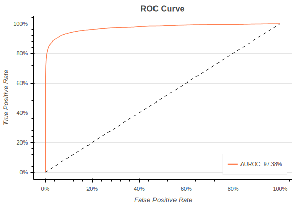

# IEEE-CIS Fraud Detection with Sagemaker Pipelines
### Goals
* Perform common predictive modeling with a SageMaker **Estimator**, **HyperparameterTuner**, and **Clarify**.
* Use **SageMaker Pipelines** to orchestrate predictive modeling workflow.
  
### Requirements
* The dataset can be downloaded from [this Kaggle competition](https://www.kaggle.com/c/ieee-fraud-detection).
* In addition to the [Anaconda](https://www.anaconda.com) libraries, you need to install `category_encoders`, `selenium`, `geckodriver` and `scikit-learn` version 0.24 or higher.
* You also need to set up an AWS account and install `awscli`, `sagemaker-python-sdk`, and `sagemaker-inference-toolkit`.

## SageMaker Estimator, HyperparameterTuner, and Clarify
### Data Splitting and Preprocessing
The features have been properly preprocessed. In particular, since *[XGBoost](https://arxiv.org/pdf/1603.02754.pdf)* does not have the ability to directly process categorical features, they were quantified using *[Target Encoding](https://dl.acm.org/doi/10.1145/507533.507538)* of `category_encoders`.
  
### Hyperparameter Tuning
First, **Estimator** was defined as SageMaker's **XGBoost framework**. The optimal hyperparameter values were then efficiently obtained by fitting a **HyperparameterTuner** that automatically initiates a *Bayesian search*. Here is the convergence plot and the search results for each parameter.


### Model Evaluation
After defining the **Transformer** of the optimal **Estimator**, the predicted values were obtained in batches through **Batch Transform**. By comparing them to labels, predictive performance can be measured, which is the confusion matrix, ROC curve, and Precision - Recall curve plotted below.
  
| Accuracy | Precision | Recall |   F1   | AUROC  | AUPRC  |    
|:--------:|:---------:|:------:|:------:|:------:|:------:|
|  98.86%  |  93.80%   | 72.25% | 81.63% | 97.38% | 86.93% |  





### Model Retraining
Finally, after retraining the model by combining the training and test sets, unlabeled dataset was predicted and scores were submitted to Kaggle. (AUROC 90.63% has been achieved.)

### Model Explanation
*[Shapley values](https://proceedings.neurips.cc/paper/2017/file/8a20a8621978632d76c43dfd28b67767-Paper.pdf)* were calculated using **Clarify** for model explainability. As a baseline, the averages of the training set features was used, and due to computational complexity, they were calculated by sampling only a subset of the dataset. Below are the top 25 features with the highest global Shapley values.


## SageMaker Pipelines
### Setup Guide
1. A custom image must be created to use `scikit-learn` version 0.24 and `category_encoders` library. To build the image with the pre-made `Dockerfile` and push it to Amazon ECR, you need to run a shell script called `containers/run.sh`.
2. Next, set the following policy in the created ECR repository.
  ```json
     {
      "Version": "2008-10-17",
      "Statement": [
        {
          "Sid": "<Your Statement>",
          "Effect": "Allow",
          "Principal": {
            "Service": "sagemaker.amazonaws.com"
          },
          "Action": [
            "ecr:BatchCheckLayerAvailability",
            "ecr:BatchGetImage",
            "ecr:GetDownloadUrlForLayer"
          ]
        }
      ]
    }
  ```
3. Execute `conf/prerequisite.py` to upload the local data set files downloaded from Kaggle and the source code needed to build and deploy the project to the S3 bucket.
4. Create a stack with the `cfn/sagemaker-project.yml` cloud formation template to provision the necessary resources. At this time, you need to enter the SageMaker project ID and name, and the name of the bucket where you uploaded the source code in the previous step as parameters.
5. In order for the production endpoint to be deployed, it is necessary to approve the model in the model registry, see the test results for staging, and approve the subsequent progress. When the production endpoint deployment is complete, you can run `test/test.py` to see if the predicted values are coming out normally.

### Workflow 
|               Name               |               Step               |             Base Job Class              |                                   Description                                   |
|:--------------------------------:|:--------------------------------:|:---------------------------------------:|:-------------------------------------------------------------------------------:|
|          PreprocessData          |        **ProcessingStep**        |           **ScriptProcessor**           |                        Data splitting and preprocessing                         |
| TrainModel (TuneHyperparameters) | **TrainingStep** (**TunerStep**) | **Estimator** (**HyperparameterTuner**) |            A *XGBoost* **Estimator** fitting (Hyperparameter tuning)            |
|          EvaluateModel           |        **ProcessingStep**        |           **ScriptProcessor**           | The **Estimator** evaluation and saving the result to a *JSON* **PropertyFile** |
|          CheckCondition          |        **ConditionStep**         |                                         |       A target metric checking to conditionally perform subsequent steps        |
|        Re-preprocessData         |        **ProcessingStep**        |           **ScriptProcessor**           |                              Data repreprocessing                               |
|          Re-trainModel           |         **TrainingStep**         |              **Estimator**              |                       A *XGBoost* **Estimator** refitting                       |
 |   SKLearn, XGBoost RepackModel   |                                  |                                         |  A **PipelineModel** Creation with SKLearn preprocessor and XGBoost classifier  |
|          RegisterModel           |        **RegisterModel**         |                                         |  Model packing and registration in a *ModelPackageGroup* with **ModelMetrics**  |

