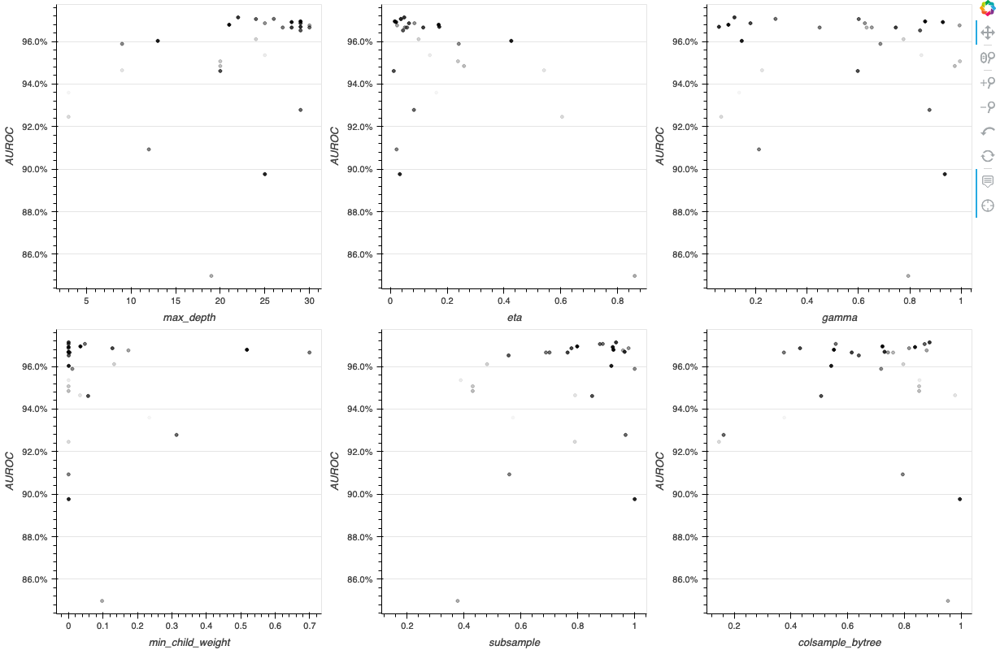

# IEEE-CIS Fraud Detection with Sagemaker Pipelines
### Goals
* Perform common predictive modeling with a SageMaker **Estimator** and **HyperparameterTuner**.
* Use **SageMaker Pipelines** to orchestrate predictive modeling workflows.
  
### Requirements
* The dataset can be downloaded from [this Kaggle competition](https://www.kaggle.com/c/ieee-fraud-detection).
* In addition to the [Anaconda](https://www.anaconda.com) libraries, you need to install `category_encoders`, `selenium`, `geckodriver` and `scikit-learn` version 0.24 or higher.
* You also need to set up an AWS account and install `awscli` and `sagemaker-python-sdk`.

## SageMaker Estimator and HyperparameterTuner
### Data Splitting and Preprocessing
I preprocessed categorical variables with missing value imputation and ordinal encoding. In the case of *[XGBoost](https://arxiv.org/pdf/1603.02754.pdf)*, there is no logic to separately process categorical variables, so I quantified them with the *[Target Encoding](https://dl.acm.org/doi/10.1145/507533.507538)* of `category_encoders`. I simply preprocessed numerical variables with missing value imputation.
  
### Hyperparameter Tuning
First, I defined an **Estimator** with SageMaker's **XGBoost framework**. Then, I efficiently obtained the optimal hyperparameter values by fitting a **HyperparameterTuner** that automatically performs a *Bayesian search*. Below are the convergence plot, and the exploration results for each parameter.
* Reference:  
  [How Hyperparameter Tuning Works](https://docs.aws.amazon.com/sagemaker/latest/dg/automatic-model-tuning-how-it-works.html)  
  [Analyze Results of a Hyperparameter Tuning Job](https://github.com/aws/amazon-sagemaker-examples/blob/master/hyperparameter_tuning/analyze_results/HPO_Analyze_TuningJob_Results.ipynb)

### Model Evaluation
After defining the **Transformer** of the optimal **Estimator**, I obtained the predicted values in batches through **Batch Transform**. By comparing them with labels, predictive performance can be measured, which are the confusion matrix, ROC curve, and Precision - Recall curve drawn below.
  
|Accuracy|Precision|Recall|F1|AUROC|AUPRC|    
|:------:|:---:|:---:|:---:|:---:|:---:|
|98.65%|92.45%|66.99%|77.69%|96.92%|83.28%|  

### Model Retraining
Finally, after retraining the model by combining the training set and the test set, I predicted the unlabeled dataset and submitted the scores. (I got AUROC 90.63%)

## SageMaker Pipelines

* [Prebuilt Amazon SageMaker Docker Images for Scikit-learn and Spark ML](https://docs.aws.amazon.com/sagemaker/latest/dg/pre-built-docker-containers-scikit-learn-spark.html)
* [Extend a Prebuilt Container](https://docs.aws.amazon.com/sagemaker/latest/dg/prebuilt-containers-extend.html)

